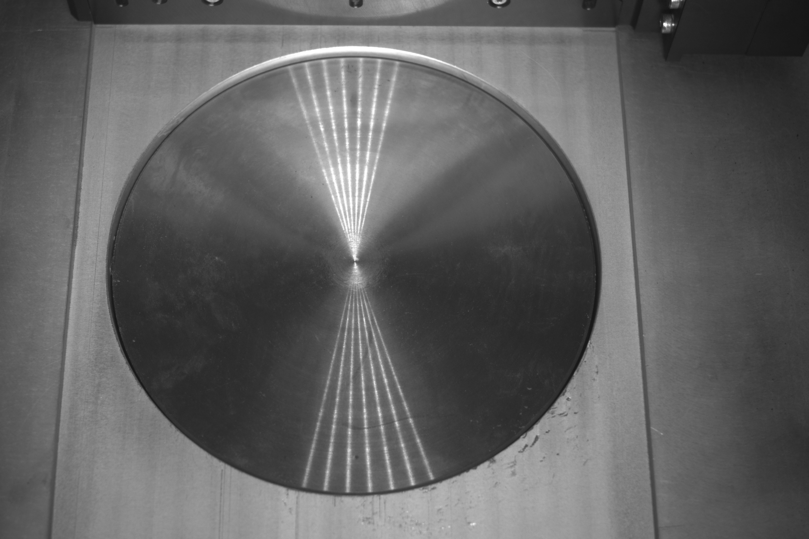

# SLM
A research focusing on [selective laser melting (SLM)](https://en.wikipedia.org/wiki/Selective_laser_melting).

The research goal is using images to predict the material properties of workpieces. The project focus on the [permeability](https://en.wikipedia.org/wiki/Permeability_(electromagnetism)), [core loss](https://en.wikipedia.org/wiki/Magnetic_core#Core_loss) and [ultimate tensile strength](https://en.wikipedia.org/wiki/Ultimate_tensile_strength).

## Used Packages
Download the used package:
```
pip3 install colorama opencv-python openpyxl
```

Download the packages to show the CT image in dicom viewer
```
pip3 install vtk pydicom PyQt5
```

Download the packages to train the models:
```
pip3 install xgboost lightgbm pandas openpyxl
pip install -U scikit-learn
```

## Verify
**Geometric Transform**: The following image is orignal SLM image and the project annotates it to get the four point in order to make use of geometric transform. The point can be found in [origin.json](data/geometric/origin.json)



Use [melt_geometric.py](melt_geometric.py) to generate orthographic projection image.
```
make geometric-transform
```

**Isolate workpieces in image**: To have a better analysis for every workpieces, need to isolate them from image. Therefore, using [melt_contour.py](melt_contour.py) to isolate workpiece from image by using mask image (*.bmp).
```
make find-contours
```

**Gray Level Co-occurrence Matrix (GLCM)**: Because the defects in image is difficult to identify, introducing the GLCM to compute the different features in image.
```
make gen-glcm
```

**Computed Tomography (CT)**: Use computed tomography image make us observe workpiece quality more clearly. In this project, using file `melt_jpg2dicom.py` to convert the `.jpg` files to `.dcm` files which usually are applied in biomedical field. On the other hand, display the dicom image by file `melt_dicom_viewer.py` the reference to [QtVTKDICOMViewer](https://github.com/RasmusRPaulsen/QtVTKDICOMViewer).

Show the CT image in dicom viewer:
```
make computed-tomography
```

**Dataset Format**: To predict the material property via training the regression model, like xgboost and svm. Please obey the dataset format as following:

In GLCM dataset, keep the name of sheet is similar with **traila_0b**. "a" means the group number that workpieces producted by the same produce parameter. "b" means the label of workpieces in one group.

| layer | energy | entropy | contrast | idm | autocorrelation | mean_x | mean_y | variance_x | variance_y | standard_deviation_x | standard_deviation_y | correlation | dissimilarity |
| ----- | ------ | ------- | -------- | --- | --------------- | ------ | ------ | ---------- | ---------- | -------------------- | -------------------- | ----------- | ------------- |
| 7 | 0.00 | 8.32 | 112,897.64 | 0.15 | 18,438.60 | 130.59 | 130.55 | 1,592.05 | 1,592.05 | 39.90 |　39.90 | 0.87 | 10.53 |

In material property dataset, keep the name of sheet is same as the property key. In the other hand, the dataset is combine with the process parameters and material property. Set the option `use_proc_param` true if you want to add process parameter into train dataset and test dataset. Finally, keep the following dataset format:

| oxygen concentration | laser power | scanning velocity | layer height | energy density | trail | item1 | item2 | item3 | item4 | item5 | item6 |
| -------------------- | ----------- | ----------------- | ------ | -------------- | ----- | ----- | ----- | ----- | ----- | ----- | ----- |
| 0 | 150 | 400 | 0.05 | 115.39 | 1 | 820.91 | 836.36 | X | X | 842.98 | X |

**Regression model**: Use [XGBoost](https://github.com/dmlc/xgboost), [lightGBM](https://github.com/microsoft/LightGBM), [Linear Regression](https://scikit-learn.org/stable/modules/generated/sklearn.linear_model.LinearRegression.html) and [SVM](https://scikit-learn.org/stable/modules/generated/sklearn.svm.SVR.html) to predict the material property include [permeability](https://en.wikipedia.org/wiki/Permeability_(electromagnetism)), [core loss](https://en.wikipedia.org/wiki/Magnetic_core#Core_loss) and [ultimate tensile strength](https://en.wikipedia.org/wiki/Ultimate_tensile_strength) via data generated from [GLCM](https://en.wikipedia.org/wiki/Co-occurrence_matrix#Other_applications). The GLCM data can be found in folder `/data/glcm-data/`.

Train the XGBoost, lightGBM, Linear Regression or SVR model:
```
make train-model
```

## Reference
* [lightGBM manual](https://lightgbm.readthedocs.io/en/v3.3.2/)
* [XGBoost manual](https://xgboost.readthedocs.io/en/stable/)
* [linear regression manual](https://scikit-learn.org/stable/modules/generated/sklearn.linear_model.LinearRegression.html)
* [logistic regression manual](https://scikit-learn.org/stable/modules/generated/sklearn.linear_model.LogisticRegression.html)
* [SVM manual](https://scikit-learn.org/stable/modules/generated/sklearn.svm.SVR.html)
